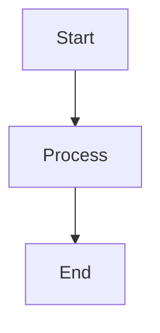

# Documentation Style Guide

This style guide defines the standards and conventions for contributing to the Physical AI & Humanoid Robotics book. Following these guidelines ensures consistency, readability, and maintainability across all content.

## Content Structure

### Document Template
Every document should follow this basic structure:

```markdown
---
sidebar_position: [number]
title: "Descriptive Title"
description: "Brief description of the content"
tags: [tag1, tag2, tag3]
---

# Main Title

## Section Headers

### Subsection Headers

Content goes here...

## Another Section

Content continues...
```

### Frontmatter Requirements
- **sidebar_position**: Integer indicating order in sidebar
- **title**: Clear, descriptive title (max 60 characters)
- **description**: Concise summary (max 160 characters)
- **tags**: 3-5 relevant tags in lowercase, hyphenated if needed

## Writing Guidelines

### Tone and Style
- Use **active voice** when possible
- Write in **second person** ("you" instead of "the user")
- Keep sentences **short and clear**
- Use **present tense** for instructions
- Maintain **consistent terminology**

### Technical Writing
- Define technical terms when first used
- Use **code blocks** for commands, file names, and technical terms
- Include **context** before technical explanations
- Link to **external documentation** when appropriate
- Use **specific examples** rather than abstract concepts

## Markdown Standards

### Headers
```markdown
# Main Title (H1) - Only one per document
## Section Header (H2) - Major sections
### Subsection Header (H3) - Subtopics
#### Minor Header (H4) - Rarely needed
```

### Code Blocks
- Use appropriate language identifiers
- Use `bash` for terminal commands
- Use `python` for Python code
- Use `xml` for XML/URDF content
- Use `yaml` for configuration files

Example:
```python
def example_function():
    """Example Python function"""
    return "Hello, Robot!"
```

```bash
# Example bash command
ros2 run package_name executable_name
```

### Lists
- Use **hyphens** for unordered lists
- Use **numbers** for ordered lists
- Maintain **consistent indentation** (2 spaces)

```markdown
- First item
- Second item
  - Nested item
- Third item
```

### Emphasis
- Use **bold** for UI elements and important terms
- Use *italics* sparingly for emphasis
- Use `code` for file names, commands, and technical terms

## Technical Content Standards

### Code Examples
- Include **explanatory comments** in code
- Show **expected output** when relevant
- Use **realistic, practical examples**
- Include **error handling** where appropriate
- Test all code examples before submission

### Commands and Instructions
- Provide **full command paths** when needed
- Include **prerequisites** for commands
- Show **expected output** or success indicators
- Include **common troubleshooting** notes

### File and Directory References
- Use **relative paths** when possible
- Use **forward slashes** for all paths
- Use **consistent naming** for similar concepts
- Include **file extensions** for clarity

## Module Organization

### Cross-References
- Use **relative links** for internal references
- Link to **specific sections** when relevant
- Maintain **contextual links** to related content

```markdown
[Link text](./relative/path/to/document.md)
[Link to section](./document.md#section-header)
```

### Content Dependencies
- Clearly indicate **prerequisites** for each section
- Reference **previous modules** when building on concepts
- Provide **forward references** to advanced topics

## Visual Content

### Images
- Use **descriptive alt text** for accessibility
- Include **captions** explaining context
- Store images in `static/img/` directory
- Use **descriptive file names** with hyphens

```markdown

```

### Diagrams
- Use **Mermaid** for flowcharts and diagrams
- Include **alternative text** descriptions
- Keep diagrams **simple and clear**
- Use **consistent styling** across diagrams



## Accessibility Standards

### Text Alternatives
- Provide **alternative text** for all images
- Use **descriptive link text** instead of "click here"
- Include **captions** for complex diagrams
- Use **sufficient color contrast**

### Structure
- Use **proper heading hierarchy**
- Include **meaningful alt text**
- Use **lists appropriately**
- Maintain **logical reading order**

## Contribution Process

### Pull Request Guidelines
- **One topic per PR**: Focus on a single concept or fix
- **Descriptive titles**: Clearly state the purpose
- **Detailed descriptions**: Explain the changes and reasoning
- **Follow the template**: Use the provided PR template

### Review Process
- **Technical accuracy**: Verify all information is correct
- **Consistency**: Check against style guide
- **Readability**: Ensure content is clear and accessible
- **Completeness**: Verify all necessary information is included

## Quality Assurance

### Content Review Checklist
- [ ] Title is descriptive and concise
- [ ] Description is accurate and helpful
- [ ] Tags are relevant and properly formatted
- [ ] Headers follow proper hierarchy
- [ ] Code examples are tested and correct
- [ ] Links are functional and appropriate
- [ ] Images have proper alt text and captions
- [ ] Content follows accessibility guidelines
- [ ] Technical terms are defined when first used
- [ ] Examples are realistic and practical

### Testing Requirements
- Verify all **code examples** work as shown
- Test all **internal links** are functional
- Validate **frontmatter** syntax
- Check **rendering** in local Docusaurus environment
- Ensure **cross-references** work correctly

## Common Patterns

### Tutorial Structure
1. **Introduction**: What will be learned
2. **Prerequisites**: What is needed to follow along
3. **Step-by-step instructions**: Clear, numbered steps
4. **Expected results**: What should happen at each step
5. **Troubleshooting**: Common issues and solutions
6. **Next steps**: Where to go after completing the tutorial

### Concept Explanation
1. **Definition**: Clear explanation of the concept
2. **Context**: Why this concept is important
3. **Examples**: Practical applications
4. **Best practices**: Recommended approaches
5. **Common pitfalls**: What to avoid

## Maintaining Consistency

### Terminology
- Use **consistent terms** throughout the documentation
- Define **domain-specific terms** when first used
- Maintain a **glossary** of technical terms
- Follow **established conventions** in robotics/AI

### Formatting
- Use **consistent formatting** for similar elements
- Follow **established patterns** for code examples
- Maintain **uniform styling** for lists and sections
- Use **standard templates** for common content types

Following this style guide ensures that all contributors create consistent, high-quality documentation that serves our readers effectively while maintaining the technical accuracy and accessibility standards required for this advanced robotics content.